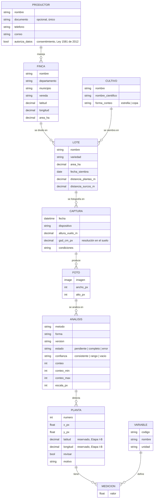

# Modelo de datos — registro de campo

Centinela registra **quién cultiva qué, dónde, cuándo se fotografió y qué se midió**. El modelo
vive en `web/campo/models.py` (Django) y se consulta en el tablero del sitio web y en el panel
de administración. La página *Modelo de datos* de la demo
(<https://centinela-demo.streamlit.app/modelo_datos>) muestra el diagrama y todas las tablas con
sus campos, tipos y llaves; lee `demo/esquema.py`, que `tests/test_esquema_web.py` compara con
los modelos de Django.

## Diagrama entidad-relación



## Entidades

| Entidad | Qué representa | Reglas |
|---|---|---|
| **Productor** | Persona responsable de una o más fincas | Datos personales mínimos; `autoriza_datos` registra el consentimiento |
| **Finca** | Predio, con ubicación administrativa (departamento, municipio, vereda) | Nombre único por productor |
| **Cultivo** | Catálogo: plátano, palma, cítricos, cacao… | `forma_conteo` indica al método cómo reconocer una planta |
| **Lote** | Unidad de manejo con un solo cultivo, su área y su marco de siembra | Nombre único por finca. Del marco se deriva la densidad teórica (plantas/ha) |
| **Captura** | Una salida a fotografiar un lote: fecha, equipo, altura y resolución en el suelo | Es la dimensión **tiempo**: varias capturas del mismo lote forman su historial |
| **Foto** | Imagen de una captura | Ancho y alto se registran al subirla |
| **Análisis** | Una corrida del método de conteo sobre una foto | Guarda método, versión, confianza y conteo o rango. Una foto admite varios análisis (p. ej., tras mejorar el método) |
| **Planta** | Planta detectada dentro de un análisis | Posición en la foto; bandera `revisar` con su motivo |
| **Variable** | Catálogo de lo que se mide en una planta | Hoy: intensidad del centro, vigor (VARI), vigor relativo |
| **Medición** | Valor de una variable en una planta | Una medición por variable y planta |

## Decisiones de diseño

1. **Planta = detección, no planta física.** Sin coordenadas geográficas no es posible saber
   que una planta de la foto de agosto es la misma de la foto de septiembre. Los campos
   `latitud` y `longitud` quedan reservados; con la georreferencia (Etapa I-B) se podrá
   añadir una entidad de planta física que agrupe sus detecciones en el tiempo.
2. **Variables como filas (modelo entidad-atributo-valor).** Añadir una medición nueva
   (NDVI, altura, diámetro de copa) consiste en registrar una `Variable`, sin modificar el
   esquema ni migrar datos.
3. **El análisis se versiona.** Cada análisis guarda la versión de `centinela_core` que lo
   produjo; al mejorar el método, las fotos se reanalizan sin perder los resultados previos.
4. **Densidad por hectárea solo con resolución conocida.** El área que cubre una foto se
   calcula con `gsd_cm_px` de la captura; sin ese dato no se reportan plantas por hectárea.
5. **Datos personales.** El productor puede registrarse sin documento de identidad; el
   consentimiento queda explícito en `autoriza_datos`.

## Uso local

```bash
.venv\Scripts\python -m pip install -e ".[web]"
.venv\Scripts\python web\manage.py migrate
.venv\Scripts\python web\manage.py createsuperuser
.venv\Scripts\python web\manage.py cargar_demo
.venv\Scripts\python web\manage.py runserver
```

Tablero en <http://127.0.0.1:8000/>, administración en <http://127.0.0.1:8000/admin/>.
`cargar_demo` crea dos fincas ficticias con fotos sintéticas y las analiza.
